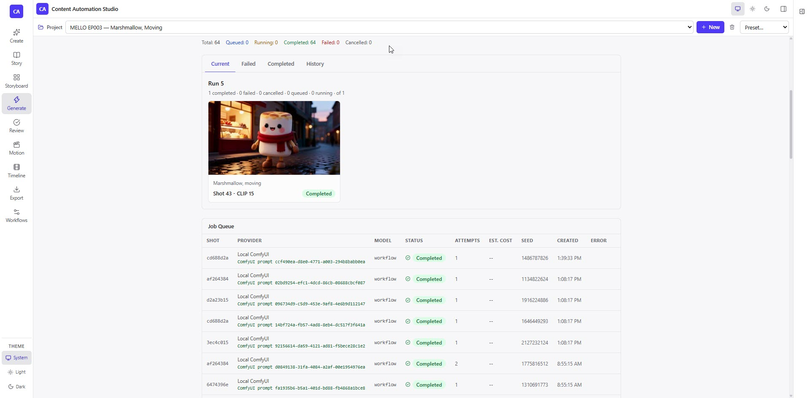
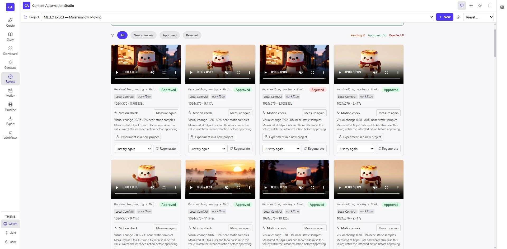
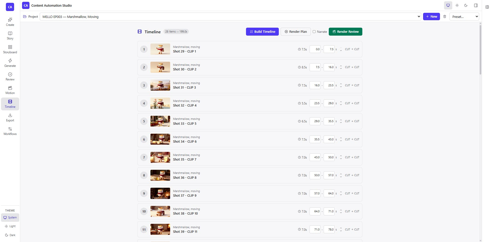

# Content Automation Studio

Make a narrated short film on your own machine. Write the story, break it into
shots, let ComfyUI draw and animate them, approve the ones that work, and get
back a finished film with narration and subtitles.

Built for someone who already has a GPU and a working ComfyUI. Developed on an
RTX 5080 (16 GB) with ComfyUI 0.34.0 on Windows.

**[คู่มือเริ่มต้นภาษาไทย →](README.th.md)**


*Six seconds spanning one cut. The two shots were drawn and animated
separately, and the character holds its shape across the join — which is the
problem this exists to solve.*

---

## What it looks like

**Generate** — shots go out to ComfyUI and come back. Every job records its
seed, its prompt id and what it cost.



**Review** — approve or reject each take. Clips are measured for how much they
actually move, so a still that never animated does not quietly reach the cut.



**Timeline** — approved takes only, with in and out points you can adjust
before the render.



---

## What it has made

| Film | Length |
|------|--------|
| MELLO EP003 — Marshmallow, Moving | 3:19 |
| NORI EP001 — The Rice Ball Is Older Than The Bowl | 10:13 |
| MELLO EP002 — The Name That Outlived The Plant | 9:38 |
| The Boy Who Swept the Sky | 3:04 |
| The Cartographer of Small Things | 3:04 |

Watch them on the [releases page](../../releases) — they are attached there
rather than committed, so cloning this does not drag a hundred megabytes of
video with it.

---

## Quick start

You need Python 3.11+, Node 18+, and FFmpeg if you want a rendered film rather
than a render plan. ComfyUI and an OpenAI key are both optional.

```bash
git clone https://github.com/Jaruphat/ContentAutomationStudio.git
cd ContentAutomationStudio
cp .env.example .env                 # defaults are fine; nothing needs filling in

cd backend
python -m venv .venv && .venv\Scripts\activate   # Linux/macOS: source .venv/bin/activate
pip install -r requirements.txt
python -m uvicorn app.main:app --host 127.0.0.1 --port 8001

# in a second terminal
cd frontend && npm install && npm run dev
```

Open <http://localhost:5173>.

**It runs with nothing installed.** Without a key and without ComfyUI, every
page works on deterministic mock providers — shots generate placeholder images
and the render produces a plan. Look around before downloading 30 GB of models.

To make it real, set `COMFYUI_PROVIDER=real` in `.env`, then **register a
workflow**: export your graph from ComfyUI with *Workflow → Export (API)*, open
the Workflows page, and bind its fields to node ids. This is the one step a
fresh install cannot skip — a shot has nothing to generate with until a graph
is mapped. [The details are here](docs/MODELS_AND_WORKFLOWS.md).

---

## Models

None ship with the repo. **Start with these two — stills plus motion is a whole
film, for about 30 GB.** Folders are relative to your ComfyUI `models/`.

**Z-Image Turbo** — stills, about 20 s each

| File | Size | Folder |
|------|------|--------|
| `z_image_turbo_int8_convrot.safetensors` | 5.8 GB | `diffusion_models/` |
| `qwen_3_4b.safetensors` | 7.5 GB | `text_encoders/` |
| `ae.safetensors` | 0.3 GB | `vae/` |

**Wan 2.2 TI2V 5B** — motion, about 0.74 s per frame, from
[Comfy-Org/Wan_2.2_ComfyUI_Repackaged](https://huggingface.co/Comfy-Org/Wan_2.2_ComfyUI_Repackaged)

| File | Size | Folder |
|------|------|--------|
| `wan2.2_ti2v_5B_fp16.safetensors` | 9.3 GB | `diffusion_models/` |
| `umt5_xxl_fp8_e4m3fn_scaled.safetensors` | 6.3 GB | `text_encoders/` |
| `wan2.2_vae.safetensors` | 1.3 GB | `vae/` |

Wan was measured 2.4x faster than MiniMax H3 on the same frame, and it takes
direction better: told to stay seated it stayed seated, where H3 stood the
character up and walked him at the camera.

Qwen-Image-Edit for character continuity, MiniMax H3 and Boogu Edit are
optional — [the full list is here](docs/MODELS_AND_WORKFLOWS.md), with sizes
and folders for each.

---

## How it works

`Story → Storyboard → Generate → Review → Timeline → Export`

1. **Story** — a brief and a plot become scenes and shots.
2. **Storyboard** — each shot gets a compiled prompt, layered from the story
   bible, the scene and the shot itself.
3. **Generate** — shots are queued to ComfyUI or the OpenAI Images API. The
   exact graph submitted is saved, so a result can be reproduced.
4. **Review** — approve or reject each take, and regenerate what failed.
5. **Timeline** — approved takes only, in order, with adjustable in and out
   points.
6. **Export** — FFmpeg cuts them together, mixes the narration and burns the
   subtitles.

Node ids live only in a workflow's field mapping, never in the application's
logic, so re-exporting a graph with different numbering is a mapping fix rather
than a code change.

An approved still can also be **animated into a clip** that starts from that
exact frame, and the still comes off the cut automatically.

---

## Documentation

| Document | What is in it |
|----------|---------------|
| [Development](docs/DEVELOPMENT.md) | Setup, running, and the test suites in detail |
| [Architecture](docs/ARCHITECTURE.md) | How the pieces fit, directory by directory |
| [Models and workflows](docs/MODELS_AND_WORKFLOWS.md) | Every model, and notes on specific graphs |
| [Status and verification](docs/STATUS.md) | What is built, what is verified, what is blocked |
| [PRD v0.4](docs/PRD_Content_Automation_Studio_v0.4.md) | Current product scope |
| [Release evidence](docs/release_evidence/) | The measurements behind each claim |

Run the tests with `cd backend && python -m pytest tests/ -q` and
`cd frontend && npm test`.

---

## License

[MIT](LICENSE). Use it, change it, ship it; keep the copyright notice.

The licence covers this application's own code. The models, the ComfyUI
workflows you export, and anything you generate with them carry their own
terms — check the licence of each model you download before publishing what it
makes.
